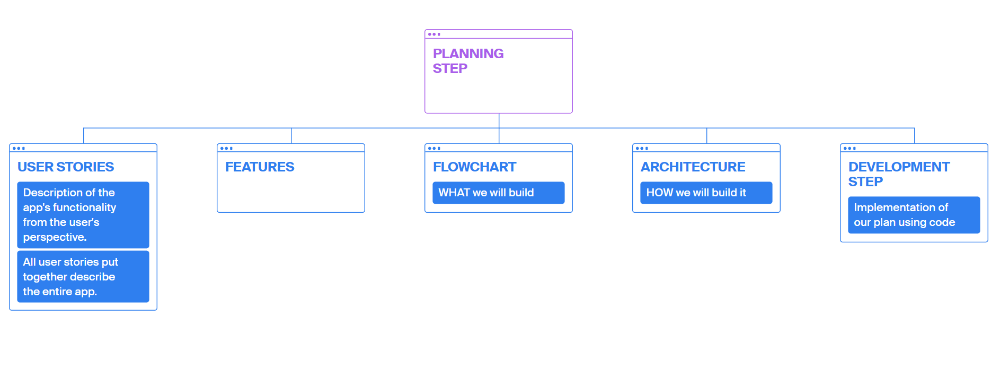
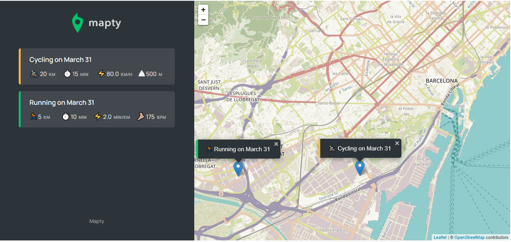

# MAPTY APP: OOP, GEOLOCATION, EXTERNAL LIBRARIES
**The goal of this app is to mark your workouts**
--------  
 

## Before writing our first line of code, we need to plan this project❗   
 

     

 

| **USER STORIES**  | **FEATURES** 
| :---              |  :----  |      
| 1. As a user I want to **log my running workouts with location, distance, time, pace and steps/minute**, so I can keep a log of all my running       | ✔️ Map where the user clicks to add new workout         
|    | ✔️ Geolocation to display map at current location        
|    | ✔️ Form to input distance, time, pace, steps/minute 
| 2. As a user, I want to **log my cycling workouts with location, distance, time, speed and elevation gain**, so I can keep a log of all my cycling  | ✔️ Form to input distance, time, speed, elevation gain
| 3. As a user, I want to **see all my workouts at a glance**, so I can easily track my progress over time  | ✔️ Display all workouts in a list
| 4. As a user, I want to **also see my workouts on a map**, so I can easily check where I work out the most  | ✔️ Display all workouts on the map
| 5. As a user, I want to **see all my workout when I leave the app and come back later**, so that I can keep using the app over time | ✔️ Store workout data in the browser using local storage API
|    | ✔️ On page load, read the saved data from local storage and display 
|    | ✔️ Move map to the workout location on click     

 

  

___   

**APP FLOWCHART**

 

___ 

 

**APP ARCHITECTURE**  

 

___ 

 

### **HOW TO USE THE APP**

*i.e   
- Click anywhere on the map  
- On the sidebar, a form will appear  
- Type Running
- Distance 5 
- Duration 20
- Cadence 175  
- *hit $enter*  
*Et Voilá* 😍  
It prints the outcome on the sidebar, and you also get a pin and a pop-up on our map.

👉 You can then click on any of the results, and it will automatically move the app to that workout.  

**BROWSER API**   
When you close the app, and then reload it, it will keep its state.  
*This data about the workouts it's going to be stored in the browser, and then each time we reload the page, we will read the data from the browser.*

___  

## Final result

  
___  

## DEMO
https://mapty-map-your-workouts-oop.netlify.app/
  
___    
